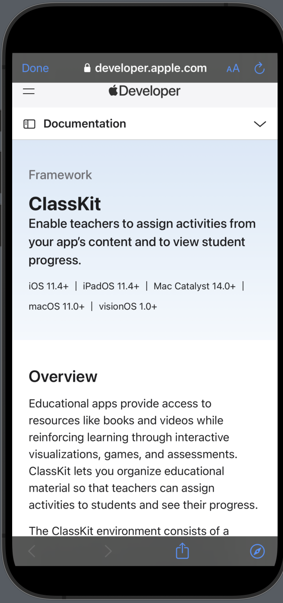

# AppleFrameworksApp

**AppleFrameworksApp** is a beautifully designed iOS application built with SwiftUI that showcases various Apple frameworks. Each framework is displayed with its name, description, and logo. By tapping the "Learn More" button, users are redirected to the official Apple Developer website for more detailed information.

## Features

- Clean and modern SwiftUI layout.
- Browse Apple frameworks like ARKit, CoreML, CloudKit, etc.
- View descriptions and logos for each framework.
- Tap "Learn More" to open the official Apple Developer documentation in Safari.

## Screenshots

  
  &nbsp;&nbsp;&nbsp;
  
  
  

## Technologies Used

- SwiftUI
- SafariServices (for opening external links)
- MVVM architecture

## How It Works

1. Browse the list of frameworks.
2. Tap on any item to view details.
3. Hit the **Learn More** button to open Apple's official page in your browser.

---

Feel free to contribute or suggest improvements!
